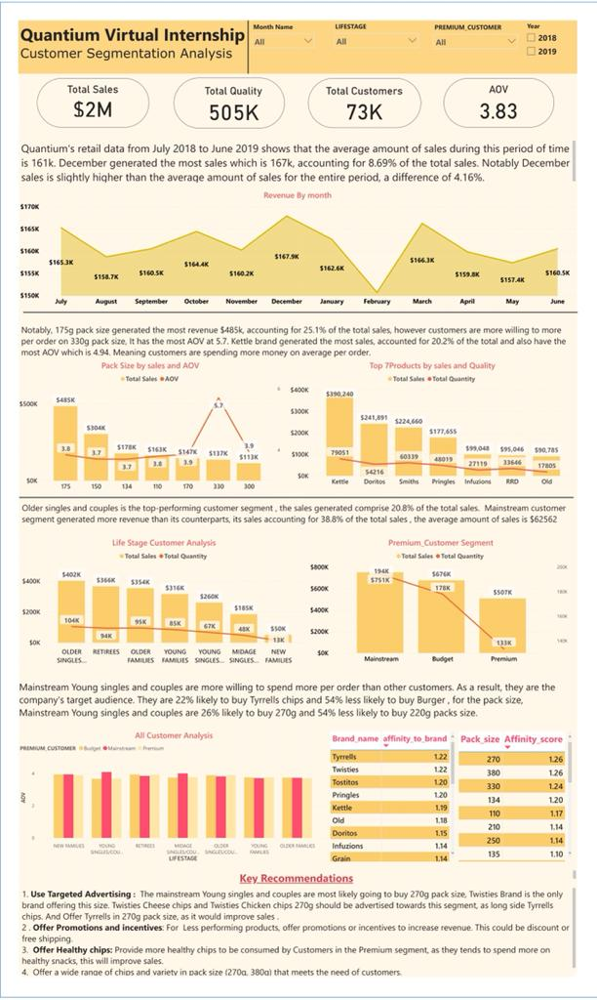

# Customer-Segementation-Analysis

I performed an intensive exploration data analysis with R. programming from Quantium Virtual Internship dataset and I conducted customer segementation analysis.

Quantium has had a data partnership with a large supermarket brand for the last few years who provide transactional and customer data. Supermarkets will regularly change their store layouts, product selections, prices and promotions. This is to satisfy their customer’s changing needs and preferences, keep up with the increasing competition in the market or to capitalise on new opportunities.

## Business Case
The supermarket  particularly interested in customer segments and their chip purchasing behaviour and also want to identify  Top chip purchaing Customer segment , products they will most likely buy and the product they would less likely buy, to help the business make strategic decisions. 

## In this Sales Performance Analysis Report, I provided insights like:
* Top customers and chips they wil most likely and less likely buy.
* The Pack size top customer they will most likely and less likely buy.
* Detailed sales performance analysis.

## Projects Process
* Imported the dataset Into R.Studio
* Examine transaction data – look for inconsistencies, missing data across the data set, outliers, correctly identified category items, numeric data across all tables.
deleted outliners.
* Examine customer data – checked for similar issues in the customer data, looked for nulls 
* Explored the data, created charts and graphs as well as noted any interesting trends and/or insights I found.
* I created new columns for Brand_name and pack size, so I can analyse these columns separately.
* I merged both Dataset to perfoem the affinity score analysis, to identify Brands and pack size top customer will most likley and less likely buy.
* I imported the merged dataset to PowerBi for Visualization.

 ## You can Interact with the Dash Board [here]([url](https://app.powerbi.com/view?r=eyJrIjoiZTE1YmJhMzEtZDNlYi00NmFhLWE3NjItZmM2MGJmMTM3NmZiIiwidCI6IjA1NmU1MmZmLTNmY2ItNGY2Yi04MjUxLTQ4MWVhMTIwZmQ0MSJ9))

## Summary of My findings
* The supermaket have two Customer Segments, Premium_customers( Segmentation based on financial status), Life_stage( segmentation based on Age, Marital status). Premium_customers Segment is divided into three ( Budget , Mainstream and Premium), in this segment, mainstream customers generated more revenue, its sales accounting for 38.8% of the total sales . while the LIfe_stage segement divided 7, Older singles and couples generated the most sales, comprising 20.8% of the total sales.
* The Top Customers are people in the Mainstream Young singles and couples segment. They are willing to spend more money per order.
